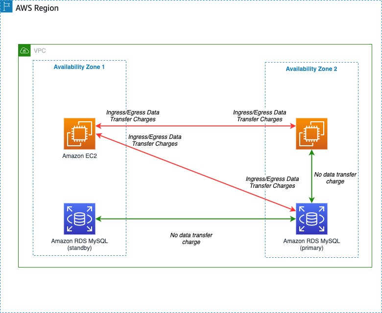
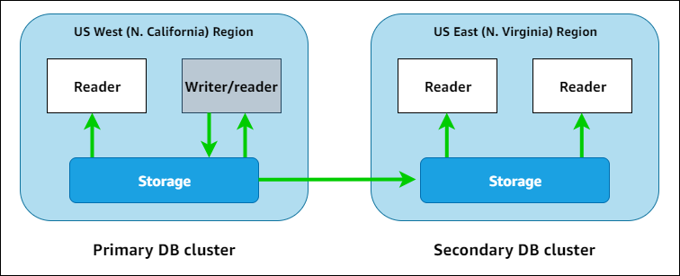
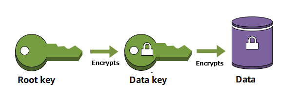
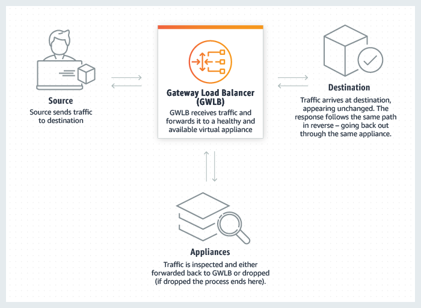

# AWS SAA-C02

This outline helps to prepare to AWS SAA-C02 exam.

Good luck. Hope you to pass it successfully.


- [AWS SAA-C02](#aws-saa-c02)
  - [Amazon EC2](#amazon-ec2)
  - [Amazon ELB](#amazon-elb)
  - [Amazon VPC](#amazon-vpc)
  - [Amazon ELB](#amazon-elb-1)
  - [Amazon S3](#amazon-s3)
  - [Amazon EFS](#amazon-efs)
  - [AWS Storage Gateway](#aws-storage-gateway)
  - [Amazon cloudfront](#amazon-cloudfront)
  - [Amazon Route53](#amazon-route53)
  - [Amazon RDS](#amazon-rds)
  - [Amazon Aurora](#amazon-aurora)
  - [Amazon KMS](#amazon-kms)
  - [Amazon DynamoDB](#amazon-dynamodb)
  - [Amazon Gateway Load Balancer](#amazon-gateway-load-balancer)
  - [Amazon kinesis Streams](#amazon-kinesis-streams)
  - [Amazon snowball](#amazon-snowball)
  - [Amazon snowball edge](#amazon-snowball-edge)
  - [Amazon SNS](#amazon-sns)
  - [Amazon Inspector](#amazon-inspector)
  - [Amazon Elastic Fabric Adapter](#amazon-elastic-fabric-adapter)
  - [Amazon Server Migration Service(SMS)](#amazon-server-migration-servicesms)
  - [Amazon athena](#amazon-athena)
  - [Amazon CloudWatch](#amazon-cloudwatch)
  - [Amazon Kinesis Firehose](#amazon-kinesis-firehose)
  - [Amazon Lambda](#amazon-lambda)
  - [Amazon Macie](#amazon-macie)
  - [Amazon Database Migration Service](#amazon-database-migration-service)
  - [IAM database authenticateion for MySQL and PostgreSQL](#iam-database-authenticateion-for-mysql-and-postgresql)
  - [Amazon Cognito](#amazon-cognito)
  - [Transit Gateway](#transit-gateway)
  - [Service control policies (SCPs)](#service-control-policies-scps)
  - [VPN CloudHub](#vpn-cloudhub)
  - [AWS import/export](#aws-importexport)
  - [Amazon EMR](#amazon-emr)


## Amazon EC2

**How to get the public IP address of your EC2 instance using the CLI?**

To determine your instance's public IP address, you can use the instance metadata. Use the following command to access the public IP address:

```shell
curl http://169.254.169.254/latest/meta-data/
```


**data transfer between EC2 in the same AZ and different AZ**

Data transferred between Amazon EC2, Amazon RDS, Amazon Redshift, Amazon ElastiCache instances, and Elastic Network Interfaces in the same Availability Zone is free.



## Amazon ELB

**NLB TLS listener and certificate**

https://aws.amazon.com/it/blogs/aws/new-tls-termination-for-network-load-balancers/


## Amazon VPC

**How do I change the IPv4 CIDR block of my Amazon Virtual Private Cloud (Amazon VPC)?**

It's not possible to modify the IP address range of an existing virtual private cloud (VPC) or subnet. You must delete the VPC or  subnet, and then create a new VPC or subnet with your preferred CIDR  block.

To extend the IPv4 address range of your VPC, you can add an additional IPv4 CIDR block.


**What is default VPC?**

By default, a default subnet is a public subnet, because the main route table sends the subnet's traffic that is destined for the internet to the internet gateway. So the instances that you launch into a default subnet receive both a public IP address and a private IP address.


**VPC Peering**

- Can connect one VPC to another using AWS intranet
- Two VPCs in the same account or different account can be connected each other.
- Do not support VPC Transitive Peering. (VPC A -> VPC B)& (VPC B -> VPC C)  != (VPC A->VPC C)


**AWS PrivateLink**

AWS PrivateLink is a highly available, scalable technology that enables you to privately connect your VPC to supported AWS services, services hosted **by other AWS accounts** (VPC endpoint services), and supported AWS Marketplace partner services. You do not need to use an internet gateway, NAT device, public IP address, AWS Direct Connect connection, or AWS Site-to-Site VPN connection to communicate with the service. Therefore, your VPC is not exposed to the public internet. 


**Interface endpoints**

An [interface endpoint](https://docs.aws.amazon.com/vpc/latest/privatelink/vpce-interface.html)(AWS PrivateLink) is an elastic network interface with a private IP address from the IP address range of your subnet. It serves as an entry point for traffic destined to a service that is owned by AWS or owned by an AWS customer or partner. For a list of AWS services that integrate with AWS PrivateLink, see [AWS services that integrate with AWS PrivateLink](https://docs.aws.amazon.com/vpc/latest/privatelink/integrated-services-vpce-list.html).

**Gateway endpoints**

A gateway endpoint is a gateway that is a target for a route in your route table used for traffic destined to either Amazon S3 or DynamoDB.

There is no charge for using gateway endpoints.

**what is egress only internet gateway?**

An egress-only internet gateway is a horizontally scaled, redundant, and highly available VPC component that allows outbound communication over IPv6 from instances in your VPC to the internet, and prevents the internet from initiating an IPv6 connection with your instances.


## Amazon ELB

**How do I attach backend instances with private IP addresses to my internet-facing load balancer in ELB?**

To attach Amazon EC2 instances located in a private subnet, create public subnets in the same Availability Zones as the private subnets used by the backend instances. Then, associate the public subnets with your load balancer.


## Amazon S3

**S3 object lock**

With S3 Object Lock, you can store objects using a write-once-read-many (WORM) model. Object Lock can help prevent objects from being deleted or overwritten for a fixed amount of time or indefinitely. You can use Object Lock to help meet regulatory requirements that require WORM storage, or to simply add another layer of protection against object changes and deletion. 


**How should I choose between S3 Transfer Acceleration and Amazon CloudFront’s PUT/POST?** 

 S3 Transfer Acceleration optimizes the TCP protocol and  adds additional intelligence between the client and the S3 bucket,  making S3 Transfer Acceleration a better choice if a higher throughput  is desired. If you have objects that are smaller than 1GB or if the data set is less than 1GB in size, you should consider using Amazon  CloudFront's PUT/POST commands for optimal performance.


**cloudfront distribution with an Amazon S3 return 403**

https://aws.amazon.com/premiumsupport/knowledge-center/s3-website-cloudfront-error-403/

- If Requester Pays is enabled, then the request must include the request-payer parameter
- Amazon S3 Block Public Access must be disabled on the bucket


**S3 Glacier **

- **Expedited —** Expedited retrievals allow you to quickly access your data when occasional urgent requests for a subset of archives are required. For all but the largest archives (250 MB+), data accessed using Expedited retrievals are typically made available within **1–5 minutes**.

- **Standard —** Standard retrievals allow you to access any of your archives within several hours. Standard retrievals typically complete within **3–5 hours**. This is the default option for retrieval requests that do not specify the retrieval option.
- **Bulk —** Bulk retrievals are S3 Glacier’s lowest-cost retrieval option, which you can use to retrieve large amounts, even petabytes, of data inexpensively in a day. Bulk retrievals typically complete within **5–12 hours**.


**compare with S3 Glacier and S3 Glacier Deep Archieve**

|Storage class|Expedited|Standard|Bulk|
|--|--|--|--|
|Amazon S3 Glacier|1-5min|3-5 hours|5-12hours|
|Amazon S3 Glacier Deep Archive|Not available|Within 12 hours|Within 48 hours|

**Sharing an object with a presigned URL**

All objects by default are private. Only the object owner has permission to access these objects. However, the object owner can optionally share objects with others by creating a presigned URL, using their own security credentials, to grant time-limited permission to download the objects.

When you create a presigned URL for your object, you must provide your security credentials, specify a bucket name, an object key, the HTTP method (GET to download the object), and the expiration date and time. Presigned URLs are valid only for the specified duration.

Anyone who receives the presigned URL can then access the object. For example, if you have a video in your bucket and both the bucket and the object are private, you can share the video with others by generating a presigned URL. 


## Amazon EFS

**Basic knowledge of EFS**

- a kind of share storage
- can be shared by multiple EC2s
- supports the Network File System version 4 (NFSv4.1 and NFSv4.0) protocol
- It is built to scale on demand to PB without disrupting applications,
- Using NFS protocol, do not support Windows System


**Kinds of EFS**

- **Standard storage classes** – EFS Standard and EFS Standard–Infrequent Access (Standard–IA), which offer multi-AZ resilience and the highest levels of durability and availability.
- **One Zone storage classes** – EFS One Zone and EFS One Zone–Infrequent Access (EFS One Zone–IA), which offer customers the choice of additional savings by choosing to save their data in a single AZ’.

The classification is like s3-standard, s3-standard-IA, s3-one Zone IA


## AWS Storage Gateway

**File Gateway**

A File Gateway is a type of Storage Gateway used to integrate your existing on-premise application with the Amazon S3. It provides **NFS (Network File System) and SMB (Server Message Block)** access to data in S3 for any workloads that require working with objects.

**Volume Gateway**

Unlike File Gateways which are used for accessing objects, Volume Gateways present your on-premise application with the **iSCSI block storage** instead. **Volume Gateways allow you to have point-in-time backups of your volumes stored as EBS snapshots**, and come in two different operational modes: stored and cached. The backup EBS snapshot is not suitable for data analyse.


**Tape Gateway**

Tape Gateway acts as an industry-standard iSCSI-based Virtual Tape Library (VTL). Deployed on-premise, it consist of virtual media changer and virtual tape drives, and allows you to continue to rely on your existing backup workflows.


**Difference between cached volumes and storage volumes for Volume Gateway**

**Cached volumes** – You store your data in Amazon Simple Storage Service (Amazon S3) and retain a copy of frequently accessed data subsets locally. Cached volumes offer a substantial cost savings on primary storage and minimize the need to scale your storage on-premises. You also retain low-latency access to your frequently accessed data.

(Create cache and then write to s3, when writing to s3 succesfully, the transaction is done).

**Stored volumes** – If you need low-latency access to your entire dataset, first configure your on-premises gateway to store all your data locally. Then asynchronously back up point-in-time snapshots of this data to Amazon S3. This configuration provides durable and inexpensive offsite backups that you can recover to your local data center or Amazon Elastic Compute Cloud (Amazon EC2). For example, if you need replacement capacity for disaster recovery, you can recover the backups to Amazon EC2.

(Write to local data, the transaction is done. The backup progress is independent from the transaction, it will backup your local data to s3 at other time).


## Amazon cloudfront

**field-level encryption**

With Amazon CloudFront, you can enforce secure end-to-end connections to origin servers by using HTTPS. Field-level encryption adds an additional layer of security that lets you protect specific data throughout system processing so that only certain applications can see it.

Field-level encryption allows you to enable your users to securely upload sensitive information to your web servers. The sensitive information provided by your users is encrypted at the edge, close to the user, and remains encrypted throughout your entire application stack. This encryption ensures that only applications that need the data—and have the credentials to decrypt it—are able to do so. 


**Configuring caching based on the language of the viewer**

If you want CloudFront to cache different versions of your objects based on the language specified in the request, configure CloudFront to forward the Accept-Language header to your origin. 


## Amazon Route53

**simple routing policy & multivalue routing policy**

Use a [simple routing](https://docs.aws.amazon.com/Route53/latest/DeveloperGuide/routing-policy.html#routing-policy-simple) policy for traffic that requires only standard DNS records, and that  doesn't require special options such as weighted routing or latency  routing. For example, use simple routing when you need to route traffic  to a single resource. You can't use multiple records of the same name  and type with simple routing. However, a single record can contain  multiple values (such as IP addresses).

 Use a [multivalue answer routing](https://docs.aws.amazon.com/Route53/latest/DeveloperGuide/routing-policy.html#routing-policy-multivalue) policy to help distribute DNS responses across multiple resources. For  example, use multivalue answer routing when you want to associate your  routing records **with a Route 53 health check**. For example, use  multivalue answer routing when you need to return multiple values for a  DNS query and route traffic to multiple IP addresses.


**Differences between R53 failover routing policy and multivalue policy.**

Imagine a scenario where you had servers in California, USA and North  Virginia, USA, but all of your customers are in N. Virgina. Using  Failover Routing you can have all of your traffic go to N. Virgina when  it’s online and only to California when it’s not. If you were to use the same servers in Multivalue Answer Routing then you would effectively  see a 50/50 split of traffic going to both. Your customers going to  California may see a degraded user experience. 


**Difference between Active-active failover and Active-passive failover**

**Active-active failover**

Use this failover configuration when you want all of your resources to be available the majority of the time. When a resource becomes unavailable, Route 53 can detect that it's unhealthy and stop including it when responding to queries.

In active-active failover, all the records that have the same name, the same type (such as A or AAAA), and the same routing policy (such as weighted or latency) are active unless Route 53 considers them unhealthy. Route 53 can respond to a DNS query using any healthy record. 

**Active-passive failover**

Use an active-passive failover configuration when you want a primary resource or group of resources to be available the majority of the time and you want a secondary resource or group of resources to be on standby in case all the primary resources become unavailable. When responding to queries, Route 53 includes only the healthy primary resources. If all the primary resources are unhealthy, Route 53 begins to include only the healthy secondary resources in response to DNS queries. 


## Amazon RDS

**Amazon RDS multi-AZ deployment**

[Amazon RDS Multi-AZ deployments](https://aws.amazon.com/rds/details/multi-az/) provide enhanced availability for database instances within a single AWS Region. With Multi-AZ, your data is synchronously replicated to a standby in a different Availability Zone (AZ). In the event of an infrastructure failure, Amazon RDS performs an automatic failover to the standby, minimizing disruption to your applications. 

**What is data Pump in Oracle?**

Oracle Data Pump technology enables very high-speed movement of data and metadata from one database to another


## Amazon Aurora

**what is Amazon Aurora?**

Amazon Aurora (Aurora) is a fully managed relational database engine that's compatible with MySQL and PostgreSQL. You already know how MySQL and PostgreSQL combine the speed and reliability of high-end commercial databases with the simplicity and cost-effectiveness of open-source databases. The code, tools, and applications you use today with your existing MySQL and PostgreSQL databases can be used with Aurora. With some workloads, Aurora can deliver up to five times the throughput of MySQL and up to three times the throughput of PostgreSQL without requiring changes to most of your existing applications. 

**Overview if Amazon Aurora global databases**

By using an Amazon Aurora global database, you can run your globally distributed applications using a single Aurora database that spans multiple AWS Regions.

An Aurora global database consists of one primary AWS Region where your data is mastered, and up to five read-only secondary AWS Regions. You issue write operations directly to the primary DB cluster in the primary AWS Region. Aurora replicates data to the secondary AWS Regions using dedicated infrastructure, with latency typically under a second.

In the following diagram, you can find an example Aurora global database that spans two AWS Regions. 


## Amazon KMS

**Envelope encryption**

When you encrypt your data, your data is protected, but you have to protect your encryption key. One strategy is to encrypt it. *Envelope encryption* is the practice of encrypting plaintext data with a data key, and then encrypting the data key under another key.

You can even encrypt the data encryption key under another encryption key, and encrypt that encryption key under another encryption key. But, eventually, one key must remain in plaintext so you can decrypt the keys and your data. This top-level plaintext key encryption key is known as the *root key*.




## Amazon DynamoDB

**read/write mode of dynamodb**

Amazon DynamoDB has two read/write capacity modes for processing reads and writes                                    on your tables:                                

- On-demand 

-  Provisioned (default, free-tier eligible) 

On-demand mode is a good option if any of the following are true: 

- You create new tables with unknown workloads. 
- You have unpredictable application traffic. 
- You prefer the ease of paying for only what you use.

Provisioned mode is a good option if any of the following are true: 

- You have predictable application traffic. 
- You run applications whose traffic is consistent or ramps gradually.                                                                      
- You can forecast capacity requirements to control costs. 

**Q: Does DynamoDB support in-place atomic updates?**

Amazon DynamoDB supports fast in-place updates. You can increment or decrement a numeric attribute in a row usin


## Amazon Gateway Load Balancer

**What is Gateway Load Balancer?**

Gateway Load Balancer helps you easily deploy, scale, and manage your  third-party virtual appliances. It gives you one gateway for  distributing traffic across multiple virtual appliances while scaling  them up or down, based on demand. This decreases potential points of  failure in your network and increases availability.




## Amazon kinesis Streams

**Developing Producers Using the Amazon Kinesis Producer Library**

The KPL performs the following primary tasks:                                                                     

- Writes to one or more Kinesis data streams with an automatic and configurable retry                                             mechanism                                          
- Collects records and uses PutRecords to write multiple records to                                             multiple shards per request                                          
- Aggregates user records to increase payload size and improve throughput
- Integrates seamlessly with the [Kinesis Client Library](https://docs.aws.amazon.com/kinesis/latest/dev/developing-consumers-with-kcl.html) (KCL) to de-aggregate batched                                             records on the consumer                                          
- Submits Amazon CloudWatch metrics on your behalf to provide visibility into producer                                             performance                                          

## Amazon snowball
**snowball with s3**

Currently, there is no way of uploading objects directly to S3 Glacier using a Snowball Edge. Thus, you first have to upload your objects into S3 Standard, and then use S3 lifecycle policies to transition the files to S3 Glacier.

## Amazon snowball edge

**Options for device configurations**

- **Storage optimized** – this option has the most storage capacity at up to 80 TB of usable storage space, 24 vCPUs, and 32 GiB of memory for compute functionality. You can transfer up to **100 TB** with a single Snowball Edge Storage Optimized device.
- **Compute optimized** – this option has the most compute functionality with 52 vCPUs, 208 GiB of memory, and 7.68 TB of dedicated NVMe SSD storage for instance. This option also comes with 42 TB of additional storage space.
- Compute Optimized with GPU – identical to the compute-optimized option, save for an installed GPU, equivalent to the one available in the P3 Amazon EC2 instance type.


**Overview of the File Interface**

The file interface exposes a **Network File System (NFS)** mount point for each bucket on your AWS Snowball Edge device. You can mount the file share from your NFS client using standard Linux, Microsoft Windows, or macOS commands. You can use standard file operations to access the file share.


## Amazon SNS

**Amazon SNS message filtering**

By default, an Amazon SNS topic subscriber receives every message published to the topic. To receive a subset of the messages, a subscriber must assign a *filter policy* to the topic subscription.

A filter policy is a simple JSON object containing attributes that define which messages the subscriber receives. When you publish a message to a topic, Amazon SNS compares the message attributes to the attributes in the filter policy for each of the topic's subscriptions. If any of the attributes match, Amazon SNS sends the message to the subscriber. Otherwise, Amazon SNS skips the subscriber without sending the message. If a subscription doesn't have a filter policy, the subscription receives every message published to its topic.


## Amazon Inspector

Amazon Inspector is an automated **vulnerability management** service that continually scans Amazon Elastic Compute Cloud (EC2) and container workloads for software vulnerabilities and unintended network exposure.


## Amazon Elastic Fabric Adapter

**The concept of EFA**

An Elastic Fabric Adapter (EFA) is a network device that you can attach to your Amazon EC2 instance to accelerate High Performance Computing (HPC) and machine learning applications. EFA enables you to achieve the application performance of an on-premises HPC cluster, with the scalability, flexibility, and elasticity provided by the AWS Cloud. 


## Amazon Server Migration Service(SMS)

**What is SMS?**

Server Migration Service (SMS) from AWS is **an agentless service that enables customers to simplify the AWS Migration  process by automatically replicating live server volumes from their on  premises servers in to AWS**.


## Amazon athena

**Q: whether it support REST API?**

A: yes


## Amazon CloudWatch
**CloudWatch Logs **

You can use the CloudWatch Logs agent installer on an existing EC2 instance to install and configure the CloudWatch Logs agent. After installation is complete, logs automatically flow from the instance to the log stream you create while installing the agent. The agent confirms that it has started and it stays running until you disable it.


## Amazon Kinesis Firehose
**Q: Can firehose store data into DynamoDB?**

A: No, there isn't a standard way of inserting Firehose stream data into DynamoDB.


## Amazon Lambda
**The max execution time of lambda**
AWS Lambda enables functions that can run up to 15 minutes

https://aws.amazon.com/about-aws/whats-new/2018/10/aws-lambda-supports-functions-that-can-run-up-to-15-minutes/


## Amazon Macie

**Introduction**

Amazon Macie is a fully managed data security and data privacy service that uses machine learning and pattern matching to discover and protect your sensitive data in AWS.

## Amazon Database Migration Service
**What is Amazon DMS**

AWS Database Migration Service (AWS DMS) is a cloud service that makes it easy to migrate relational databases, data warehouses, NoSQL databases, and other types of data stores. You can use AWS DMS to migrate your data into the AWS Cloud or between combinations of cloud and on-premises setups. 

## IAM database authenticateion for MySQL and PostgreSQL
**what is IAM database authenticateion**
You can authenticate to your DB instance using AWS Identity and Access Management (IAM) database authentication. IAM database authentication works with MySQL and PostgreSQL. With this authentication method, you don't need to use a password when you connect to a DB instance. Instead, you use an authentication token.

An authentication token is a unique string of characters that Amazon RDS generates on request. Authentication tokens are generated using AWS Signature Version 4. Each token has a lifetime of 15 minutes. You don't need to store user credentials in the database, because authentication is managed externally using IAM. You can also still use standard database authentication. The token is only used for authentication and doesn't affect the session after it is established. 

## Amazon Cognito
**what is Amazon Cognito?**

Amazon Cognito provides authentication, authorization, and user management for your web and mobile apps. Your users can sign in directly with a user name and password, or through a third party such as Facebook, Amazon, Google or Apple. 


## Transit Gateway
**What is ECMP?**

You can use equal-cost multi-path routing (ECMP) to get higher bandwidth by scaling horizontally across multiple Connect Peers of the same Connect Attachment or across multiple Connect Attachments on the same transit gateway


## Service control policies (SCPs) 
**what is Service control policies (SCPs)**

Service control policies (SCPs) are a type of organization policy that you can use to manage permissions in your organization. SCPs offer central control over the maximum available permissions for all accounts in your organization. SCPs help you to ensure your accounts stay within your organization’s access control guidelines. SCPs are available only in an organization that has all features enabled. SCPs aren't available if your organization has enabled only the consolidated billing features. For instructions on enabling SCPs, see Enabling and disabling policy types. 


## VPN CloudHub
**What is VPN cloudHub**

If you have multiple AWS Site-to-Site VPN connections, you can provide secure communication between sites using the AWS VPN CloudHub. This enables your remote sites to communicate with each other, and not just with the VPC. The VPN CloudHub operates on a simple hub-and-spoke model that you can use with or without a VPC. This design is suitable if you have multiple branch offices and existing internet connections and would like to implement a convenient, potentially low-cost hub-and-spoke model for primary or backup connectivity between these remote offices.

The sites must not have overlapping IP ranges.

## AWS import/export
**what does it support?**
- It can export from Amazon S3
- It can import to s3 Glacier
- It can import to EBS

## Amazon EMR
**VPC endpoint support EMR**

You can connect directly to Amazon EMR using an interface VPC endpoint (AWS PrivateLink) in your Virtual Private Cloud (VPC) instead of connecting over the internet. When you use an interface VPC endpoint, communication between your VPC and Amazon EMR is conducted entirely within the AWS network. Each VPC endpoint is represented by one or more Elastic network interfaces (ENIs) with private IP addresses in your VPC subnets.